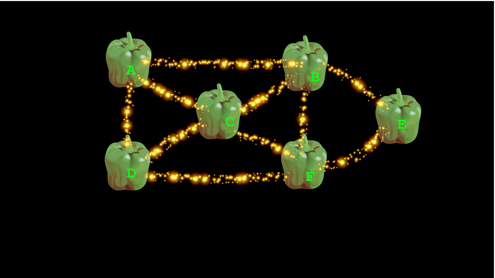
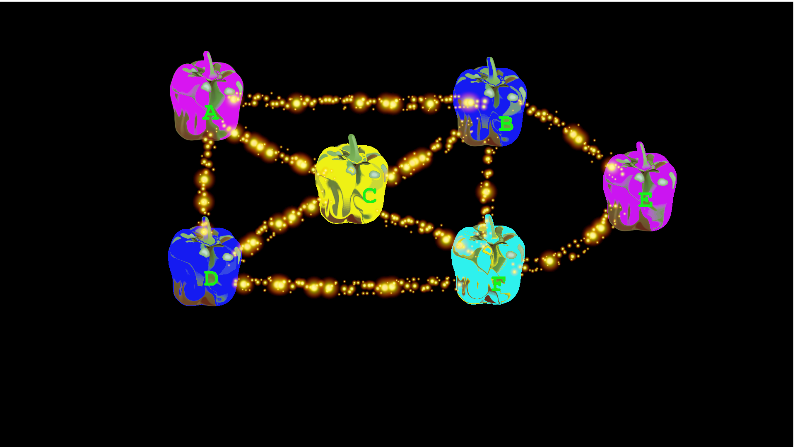
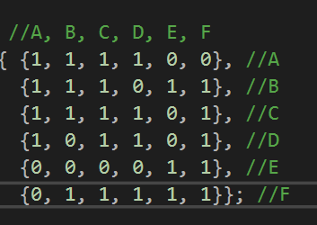

# Coloring_problem

# Problem 
Coloring the vertices of a graph such that no two adjacent vertices share the same color. 
# Applications

<li>How do we schedule university exam such that no two exams conflict with each students schedule? How many slots are needed to schedule the exam?</li>
<li>Assigning radio frequencies, frequencies assigned to specific towers must be different because of interference. How do we assign these frequencies? What's the minimum number of frequencies needed?</li>

# Solutions

Both of these are vertex coloring problems. The student is a vertex and the exams are the edges. The tower is the vertex and the frequencies are the edges.

 

# The Four Color Map Theorem - Numberphile

This problem went unsolved for over 120 years. A clerk suspected that all maps could be colored with 4 colors. Augustus De'Morgan postulated this theorem. It was validated by a COMPUTER! Please watch this wonderful youtube video for a more detailed description of the problem and solution.

# Problem Example drawn in GIMP
# Problem

<li>How can we color each vertex using 4 colors?</li>

# Visualize as tree structure

<li>Each layer is a set of possible colors that we could assign.</li>
<li>We pick one color then progress down the tree. If we end up with two adjacent verticies having the same color we back track up the tree, prune off the branch and start again. We are going to leverage backtracking</li>

# Solution.

# C++ implementation

 We can translate our pepper node picture into a matrix representation. Each row is a node if there is a 1 in the column for the associated vertex then that implies our node is connected to it by an edge. Our example picture would look like the image below

# C++ result

 This result matches with our expectation. Clone down the code and add graphics to it. I would love to see how other people use this.
